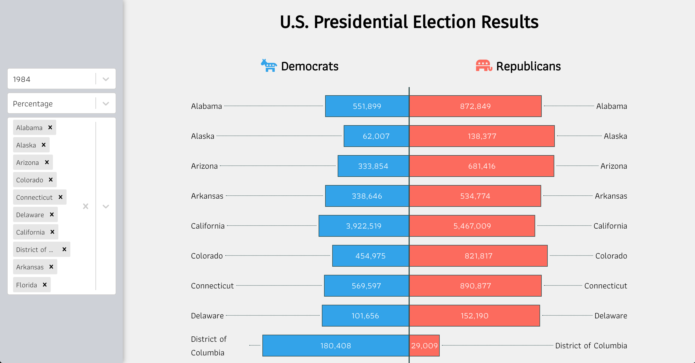

# Election Visualization Package

## Data
I am visualizing presidential election data maintained by the MIT Election Data and Science Lab. The data can be downloaded [here.](https://dataverse.harvard.edu/dataset.xhtml?persistentId=doi:10.7910/DVN/42MVDX&version=5.0)

## Visualization
I am using a butterfly (ie, verticaly stacked / horizontally aligned bar) chart to represent both major party's vote share for each state. The chart allows a user to select the election year, data format, and optionally filter for states. 

